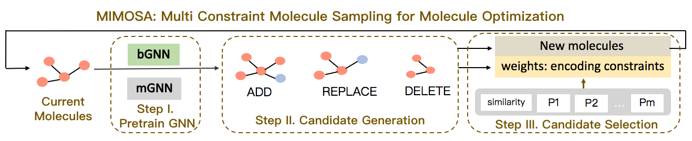

# 💊 MIMOSA: Multi-constraint Molecule Sampling for Molecule Optimization

[](https://opensource.org/licenses/BSD-2-Clause)
[](https://www.python.org/downloads/release/python-370/)
[](https://github.com/futianfan/MIMOSA/stargazers)
[](https://github.com/futianfan/MIMOSA/network/members)


This repository hosts MIMOSA: Multi-constraint Molecule Sampling for Molecule Optimization (AAAI) 2021 (Tianfan Fu, Cao Xiao, Xinhao Li, Lucas Glass, Jimeng Sun), which used pretrained graph neural network (GNN) and MCMC for molecule optimization. 




## Table Of Contents

- [Installation](#installation) 
- [Data](#data)
- [Pretraining](#pretrain)
- [Run](#run) 
- [Contact](#contact) 


<a name="installation"></a>
## ⚙️ 1. Installation 

To install locally, we recommend to install from `pip` and `conda`. Please see `conda.yml` for the package dependency. 
```bash
conda create -n mimosa python=3.7 
conda activate mimosa
pip install torch 
pip install PyTDC 
conda install -c rdkit rdkit 
```

Activate conda environment. 
```bash
conda activate mimosa
```

make directory
```bash
mkdir -p save_model result 
```

<a name="data"></a>
## 2. Data
In our setup, we restrict the number of oracle calls. In realistic discovery settings, the oracle acquisition cost is usually not negligible. 

### Raw Data 
We use [`ZINC`](https://tdcommons.ai/generation_tasks/molgen/) database, which contains around 250K drug-like molecules and can be downloaded [`download ZINC`](https://tdcommons.ai/generation_tasks/molgen/). 
```bash
python src/download.py
```
- output
  - `data/zinc.tab`: all the smiles in ZINC, around 250K. 

### Oracle
Oracle is a property evaluator and is a function whose input is molecular structure, and output is the property. 
We consider following oracles: 
* `JNK3`: biological activity to JNK3, ranging from 0 to 1.
* `GSK3B` biological activity to GSK3B, ranging from 0 to 1. 
* `QED`: Quantitative Estimate of Drug-likeness, ranging from 0 to 1. 
* `SA`: Synthetic Accessibility, we normalize SA to (0,1). 
* `LogP`: solubility and synthetic accessibility of a compound. It ranges from negative infinity to positive infinity. 

For all the property scores above, higher is more desirable. 

### Optimization Task 
There are two kinds of optimization tasks: single-objective and multi-objective optimization. 
Multi-objective optimization contains `jnkgsk` (JNK3 + GSK3B), `qedsajnkgsk` (QED + SA + JNK3 + GSK3B). 


### Generate Vocabulary 
In this project, the basic unit is `substructure`, which can be atoms or single rings. 
The vocabulary is the set of frequent `substructures`. 
```bash 
python src/vocabulary.py
```
- input
  - `data/zinc.tab`: all the smiles in ZINC, around 250K. 
- output
  - `data/substructure.txt`: including all the substructures in ZINC. 
  - `data/vocabulary.txt`: vocabulary, frequent substructures. 

### data cleaning  
We remove the molecules that contains substructure that is not in vocabulary. 

```bash 
python src/clean.py 
```

- input 
  - `data/vocabulary.txt`: vocabulary 
  - `data/zinc.tab`: all the smiles in ZINC
- output
  - `data/zinc_clean.txt`


<a name="pretrain"></a>
## Pre-train graph neural network (GNN)
```bash 
python src/train.py 
```
- input 
  - `data/zinc_clean.txt`
- output 
  - `save_model/GNN.ckpt`: trained GNN model. 
- log
  - `gnn_loss.pkl`: the valid loss. 

<a name="run"></a>
## 🤖 Run 

### de novo molecule design 

```bash
python src/run.py
```
- input 
  - `save_model/GNN.ckpt`: pretrained GNN model. 
- output 
  - `result/{$prop}.pkl`: set of generated molecules. 

For example, 
```bash 
python src/run.py
```

### evaluate 

```bash
python src/evaluate.py $prop 
```
- input 
  - `result/{$prop}.pkl`
- output 
  - `diversity`, `novelty`, `average property` of top-100 molecules with highest property. 

For example, 
```bash 
python src/evaluate.py jnkgsk 
```

<a name="contact"></a>
## Contact 
Please contact futianfan@gmail.com for help or submit an issue. 


## Cite Us
If you found this package useful, please cite our paper:
```
@inproceedings{fu2021mimosa,
  title={MIMOSA: Multi-constraint Molecule Sampling for Molecule Optimization},
  author={Fu, Tianfan and Xiao, Cao and Li, Xinhao and Glass, Lucas M and Sun, Jimeng},
  booktitle={Proceedings of the AAAI Conference on Artificial Intelligence},
  volume={35},
  number={1},
  pages={125--133},
  year={2021}
}
```


